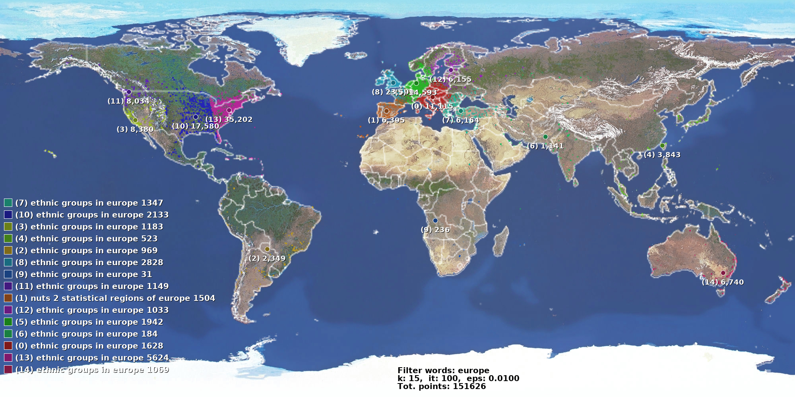

# Wikipedia-geoEdits

This is tool designed for the study of the distribution of anonymous changes made to Wikipedia pages.

The software combines the [Wikipedia edit history](https://snap.stanford.edu/data/wiki-meta.html) (Wikipedia ENG: 116.590.856 contributions) with the [ip2Location LITE database](https://lite.ip2location.com/database/ip-country-region-city-latitude-longitude-zipcode) associating each anonymous contribution with the corresponding geographic coordinates. This is possible because anonymous editors are listed by their ip address, e.g. ip:69.17.21.242.
The IP2Location LITE database provide 2.920.499 distinct location all over the world for the IP resolution.

In this study I decided to consider only the geographic coordinates and then use a clustering algorithm to perform the grouping of areas based on the concentration of the points. The distribution of the categories of interest in the different areas of the world is thus studied.

It is possible to filter categories and sub-categories and than visualize the results on a map.





## Getting Started

- download the [Wikipedia edit history](https://snap.stanford.edu/data/wiki-meta.html) 
- download the [ip2Location LITE database](https://lite.ip2location.com/database/ip-country-region-city-latitude-longitude-zipcode)
- convert the Wikipedia edit history file format to make it friendly to Spark

```bash
bzcat /your_path/enwiki-20080103.main.bz2 | python3 ./python/enwiki2csv.py | python3 ./python/ip2integer.py | bzip2 > /your_path/enwiki-longIpOnly.bz2
```


### Usage

On the first run you need to generate the category to coordinates file using the option [-a], than you can exclude that phase.

```bash
usage: ./run.sh [-a] [--dataset_folder <folder path>] [--words <required words>...]
	 	 [-k --k  <number of clusters>] [-i, --iterations  <arg>]

options:
  -a, --associate_location              Perform the association phase.
  -d, --dataset_folder  <folder path>  		Resources files folder.
  -e, --epsilon  <arg>                  Variance improvement threshold (K-Means).
  -i, --iterations  <arg>               Number of iterations (K-Means).
  -k, --k  <clusters>                   Number of clusters to create (K-Means).
  -m, --master_url  <Master URL>      Master URL
  -n, --no_words  <excluded words>...   Comma separated excluded words.
  -p, --print_numbers                   Print the numbers on the map.
  -w, --words  <required words>...      Comma separated required words.
  -h, --help                            Show help message.
```


# Scalable And Cloud Programming exam

WikiGeoEdits is realized for the course of Scalable And Cloud Programming.


### Interesting elements in the code

The software consists of several parts:

- **Phase 1**: IP addresses resolution [complete parallelism]
- **Phase 2**: filtering categories and clustering coordinates [parallelism with synchronizations]
- **Phase 3**: map print [no parallelism]


#### Phase 1 - IP addresses resolution [complete parallelism]

The goal is to get the association of edits with the location (coordinates) once and for all. The "Parsed Wikipedia edit history" consists in 116.590.856 contributions (8GB text file). Each anonymous contribution has an IP address. The software convert them into integers and look for the nearest location in the IP2LOCATION database. 

To boost the IP resolution the SW exploits the database structure.

```csv
ip_from,ip_to,latitude,longitude
"0",16777215","0.000000","0.000000"
"16777216","16777471","34.052230","-118.243680"
"16777472","16778239","26.061390","119.306110"
"16778240","16779263","-37.814000","144.963320"
"16779264","16781311","23.116670","113.250000"
"16781312","16785407","35.689506","139.691700"
"16785408","16793599","23.116670","113.250000"
"16793600","16797695","34.385280","132.455280"
...
```


Converting an IP into *Long* we get a value between one of the *ip_form* and *ip_to* pairs. The pairs are ordered and consecutive than we can consider only the ip_from values placing them into an array and use a custom version of the dichotomic search that return the lower bound of the target IP's class instead of a boolean value (the target IP may not be present but still has a class).

```scala
  def checker[T](target: T, ips: Array[T])(implicit ev: T => Ordered[T]): T = {
    // specify that the method applies to all types for which an ordering exists
    /**
     * Dichotomic search: search for the target element through the array.
     * Return the target element if present or the nearest smaller element on the left.
     * Thought for the interval research of the target.
     */

    // tail-recursive binary search for name in names
    def search(start: Int = 0, end: Int = ips.length - 1): T = {
      val mid = start + (end - start) / 2
      if (start > end) ips(start - 1)
      else if (ips(mid) == target) ips(mid)
      else if (ips(mid) > target) search(start, mid - 1)
      else search(mid + 1, end)
    }
      
    search()
  }
```


SW use broadcast variables to make this phase completely parallel between the clusters.

From [the official documentation about Broadcast Variables](http://spark.apache.org/docs/latest/programming-guide.html#broadcast-variables):

> Broadcast variables allow the programmer to keep a read-only variable cached on each machine rather than shipping a copy of it with tasks.

 ```scala
/* val locationsRDD: RDD[(Long, String)] */

val longIps: Broadcast[Array[Long]] =
	sc.broadcast(locationsRDD.keys.collect.sorted) // broadcast array through clusters
...

val editsWithIpRDD = editsRDD
    .mapValues { case edit: Edit => (checker(edit.longIp, longIps.value), edit) }
    // RDD[String, (Long, Edit)]
    .values.flatMap(
    // RDD[Long, Edit]
        edit => {
            val categoriesString = edit._2.categories
            val categories = categoriesString.split(' ')
            val ipClass = edit._1
            categories.map(category => (category, ipClass))
        })
    // RDD[(String, Long)]
    .map(t => (t._1, List(t._2)))
    .reduceByKey(_ ::: _)
    // RDD[(String, List[Long])] // (category, List of ips)
 ```


The phase 1 ends with something like this (categoty#list of Long IPs):

```bash
Italian_librettists#1363761152||3664136448|3664136448|1383812096
Italian_computer_scientists#3353255936|3353255936|344651264|344651264|...
Italian_film_directors#2478590464|2478590464|2478590464|2478590464|2478590464
Italian-American#1460734720|79237376|1165786624|1207369728|1177731072|1145931776|...
Italian_football_clubs#1354197760|3259936256|3279468032|1354094080|2306366464|...
Italian_designers#1372606976
...
```


#### Phase 2 - filtering categories and clustering coordinates [parallelism with synchronizations]

To filter categories we can list the words that have to be in the string category and the words to exclude.

```bash
usage: ./run.sh [--dataset_folder <folder path>] [--words <required words>...] [--no_words <excluded words>...]
```

To clusterize the filtered categories coordinates I use the K-Means algorithm. The geographic coordinates do not need to be modified to be used as points in the algorithm.

My implementation of the K-Means algorithm:

```scala
class My_KMeans(masterURL: String, points: RDD[Point], epsilon: Double, iterations: Int) extends Serializable {
	
    points.persist(StorageLevel.MEMORY_AND_DISK)
    
    /** Finds the closest centroid to the given point. */
    def closestCentroid(centroids: Array[Point], point: Point) = {
        centroids.reduceLeft((a, b) => if ((point distance a) < (point distance b)) a else b)


    def kmeans(centroids: Array[Point], it: Int, stopF: (Array[Point], Array[Point], Int) => Boolean): Array[Point] = {

        // associate each point with his closest centroids, than for each cluster 				// calculate the average
        val clusters = (
            this.points
            // RDD[Point]
              .map(point => KMeansHelper.closestCentroid(centroids, point) -> (point, 1))
              // RDD[Point, (Point, Int)] // RDD[ClosestCentroid, (Point, 1)]
              .reduceByKeyLocally({
                case ((ptA, numA), (ptB, numB)) => (ptA + ptB, numA + numB)
              })
              // Map[Point, (Point, Int)]
              .map({
                case (centroid, (ptSum, numPts)) => centroid -> ptSum / numPts
              })
              // Map[Point, Point]
          )

        // recalculate centroids
        val newCentroids = centroids
        // Array[Point]
        	.map(oldCentroid => {
                clusters.get(oldCentroid) match {
                    case Some(newCentroid) => newCentroid
                    case None => oldCentroid
              }
        	})
        	// Array[Point]

        if (stopF(centroids, newCentroids, it)) kmeans(newCentroids, it+1, stopF)
        else newCentroids
	}
    ...
}
```


