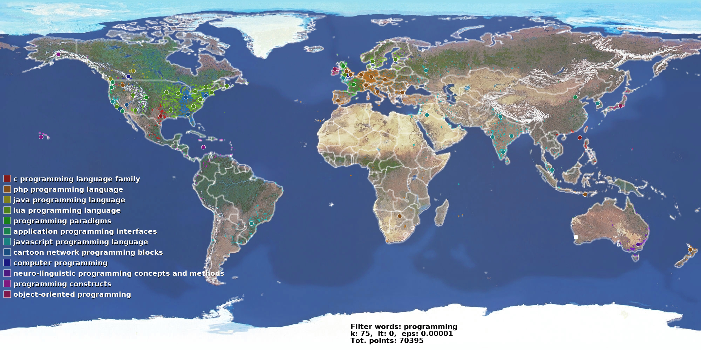
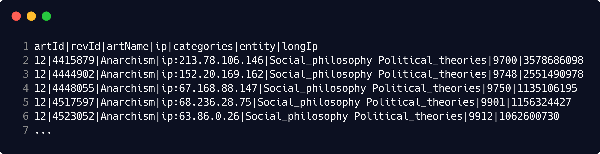
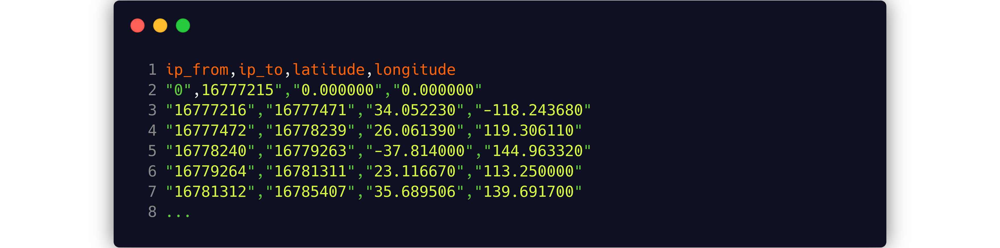
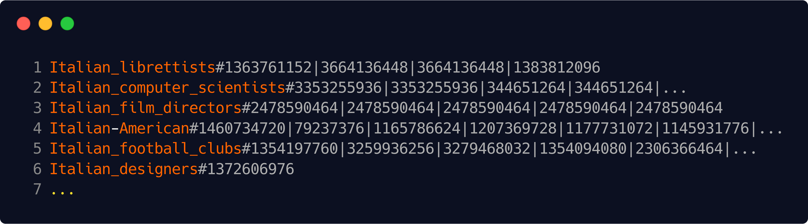
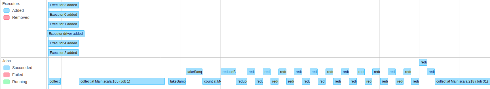
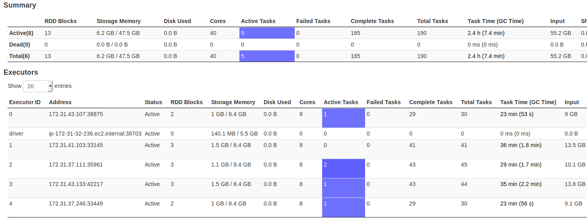

# Wikipedia-geoEdits

This is tool designed for the study of the distribution of anonymous changes made to Wikipedia pages.

The software combines the [Wikipedia edit history](https://snap.stanford.edu/data/wiki-meta.html) (Wikipedia ENG: 116.590.856 contributions) with the [ip2Location LITE database](https://lite.ip2location.com/database/ip-country-region-city-latitude-longitude-zipcode) associating each anonymous contribution with the corresponding geographic coordinates. This is possible because anonymous editors are listed by their ip address, e.g. ip:69.17.21.242.
The IP2Location LITE database provide 2.920.499 distinct location all over the world for the IP resolution.

In this study I decided to consider only the geographic coordinates and then use a clustering algorithm to perform the grouping of areas based on the concentration of the points. The distribution of the categories of interest in the different areas of the world is thus studied.

It is possible to filter categories and sub-categories and than visualize the results on a map.





### Dependencies

- Java : 1.8.
- Scala : 2.11.12
- Spark : 2.3.4

- sbt : 1.1.6

  

### Getting Started

- download the [Wikipedia edit history](https://snap.stanford.edu/data/wiki-meta.html) 
- download the [ip2Location LITE database](https://lite.ip2location.com/database/ip-country-region-city-latitude-longitude-zipcode)
- convert the Wikipedia edit history file format to make it friendly to Spark

```bash
bzcat /your_path/enwiki-20080103.main.bz2 | python3 ./python/enwiki2csv.py | python3 ./python/ip2integer.py | bzip2 > /your_path/enwiki-longIpOnly.bz2
```

Output:




### Usage

On the first run you need to generate the category to coordinates file using the option [-a], than you can exclude that phase.

```bash
usage: ./run.sh [-a] [--dataset_folder <folder path>] [--words <required words>...]
	 	 [-k --k  <number of clusters>] [-i, --iterations  <arg>]

options:
  -a, --associate_location              Perform the association phase.
  -d, --dataset_folder  <folder path>  		Resources files folder.
  -e, --epsilon  <arg>                  Variance improvement threshold (K-Means).
  -i, --iterations  <arg>               Number of iterations (K-Means).
  -k, --k  <clusters>                   Number of clusters to create (K-Means).
  -m, --master_url  <Master URL>      Master URL
  -n, --no_words  <excluded words>...   Comma separated excluded words.
  -p, --print_numbers                   Print the numbers on the map.
  -w, --words  <required words>...      Comma separated required words.
  -h, --help                            Show help message.
```


### Deploy on Amazon AWS

I used AWS Educate services including Amazon S3 buckets to store datasets (also for the .jar transfer because it's extremely faster than copy from local). Students can retrieve credentials in the Vocareum page (Account Details), before opening the AWS console. Create the file *~/aws/.credentials* and copy the credentials on it. The session will be interrupted after 2:30, but the running machine will continue to go and consume credits. Re-login to Vocareum to start a new session. Create a new *pair key* from the AWS Console and place the .pem file on the deploy folder.

To start and manage nodes I used the command line tool [flintrock](https://github.com/nchammas/flintrock).  In the [deploy folder](https://github.com/CecchiLinux/wikipedia-geoEdits/tree/master/deploy) there is the *deploy.sh* command used to:

- install Java and Spark on each node
- transfer the aws credential on each node
- transfer the datasets on each node

Create the *conf.yaml* usign the Flintrock command line. You have to specify the region (us-east-1 is the only available for students), the identity-file (.pem path), the OS (ami) and the number of slaves.

Flintrock may fail with this message: 

```bash
SSH protocol error. Possible causes include using the wrong key file or username.
Do you want to terminate the 6 instances created by this operation? [Y/n]: Y
Terminating instances...
```

Type "Y" and re-try, it usually works.

SSH the master node (AWS console, go to "running instances", right-click on the master node, "connect") and run a command like this:

```bash
spark/bin/spark-submit --master spark://[private_ip] --conf spark.driver.maxResultSize=3g  --driver-memory 10G --executor-memory 15G --class "Main" --deploy-mode client wiki_geo_edits.jar -d /home/ec2-user -w italian -k 15 -i 10 -m spark://[private_ip]:7077
```

You can retrieve the private IP of the master node in the master node info (AWS console, go to "running instances", click on the master node). You can view the Spark UI console going to http://master-node-public-ip:4040.


## Acknowledgments

Thanks to [Chimpler](https://github.com/chimpler/tweet-heatmap) for the print of coordinates on the map.


# Scalable And Cloud Programming exam

WikiGeoEdits project is realized for the course of Scalable And Cloud Programming.


### Interesting elements in the code

The software consists of several parts:

- **Phase 1**: IP addresses resolution [complete parallelism]
- **Phase 2**: filtering categories and clustering coordinates [parallelism with local reduce]
- **Phase 3**: date analysis [parallelism with local reduce]
- **Phase 4**: map print [no parallelism]


#### Phase 1 - IP addresses resolution [complete parallelism]

The goal is to get the association of edits with the location (coordinates) once and for all. The "Parsed Wikipedia edit history" consists in 116.590.856 contributions (8GB text file). Each anonymous contribution has an IP address (33.875.047 contributions). The software convert them into integers and look for the nearest location in the IP2LOCATION database.  

To boost the IP resolution the SW exploits the database structure.




Converting an IP into *Long* we get a value between one of the *ip_form* and *ip_to* pairs. The pairs are ordered and consecutive than we can consider only the ip_from values placing them into an array and use a custom version of the dichotomic search that return the lower bound of the target IP's class instead of a boolean value (the target IP may not be present but still has a class).

```scala
  def checker[T](target: T, ips: Array[T])(implicit ev: T => Ordered[T]): T = {
    // contentx bound specify that the method applies to all types for which an 
    // ordering exists (permits the "greater than")
    /**
     * Dichotomic search: search for the target element through the array.
     * Return the target element if present or the nearest smaller element on the left.
     * Thought for the interval research of the target.
     */

    // tail-recursive binary search for name in names
    def search(start: Int = 0, end: Int = ips.length - 1): T = {
      val mid = start + (end - start) / 2
      if (start > end) ips(start - 1)
      else if (ips(mid) == target) ips(mid)
      else if (ips(mid) > target) search(start, mid - 1)
      else search(mid + 1, end)
    }
      
    search()
  }
```


SW use broadcast variables to make this phase completely parallel between the clusters.

From [the official documentation about Broadcast Variables](http://spark.apache.org/docs/latest/programming-guide.html#broadcast-variables):

> Broadcast variables allow the programmer to keep a read-only variable cached on each machine rather than shipping a copy of it with tasks.


 ```scala
/* val locationsRDD: RDD[(Long, String)] */

val longIps: Broadcast[Array[Long]] =
	sc.broadcast(locationsRDD.keys.collect.sorted) // broadcast array through clusters
...

val editsWithIpRDD = editsRDD
    .mapValues { case edit: Edit => (checker(edit.longIp, longIps.value), edit) }
    // RDD[String, (Long, Edit)]
    .values.flatMap(
    // RDD[Long, Edit]
        edit => {
            val categoriesString = edit._2.categories
            val categories = categoriesString.split(' ')
            val ipClass = edit._1
            categories.map(category => (category, ipClass))
        })
    // RDD[(String, Long)]
    .map(t => (t._1, List(t._2)))
    .reduceByKey(_ ::: _)
    // RDD[(String, List[Long])] // (category, List of ips)
 ```


The phase 1 ends with something like this (categoty#list of Long IPs):




#### Phase 2 - filtering categories and clustering coordinates [parallelism with local reduce]

To filter categories we can list the words that have to be in the string category and the words to exclude.

```bash
usage: ./run.sh [--dataset_folder <folder path>] [--words <required words>...] 
				[--no_words <excluded words>...]
```


To group the filtered categories coordinates I use the K-Means algorithm. The geographic coordinates do not need to be modified to be used as points in the algorithm.

```scala
class Point(val x: Double, val y: Double) extends Serializable {
  def + (that: Point) = new Point(this.x + that.x, this.y + that.y)
  def - (that: Point) = this + (-that)
  def unary_- () = new Point(-this.x, -this.y)
  def / (d: Double) = new Point(this.x / d, this.y / d)
  def magnitude = math.sqrt(x * x + y * y)
  def distance(that: Point) = (that - this).magnitude // Euclidean distance
  override def equals(that: Any): Boolean = {
    that match { case that : Point => this.x == that.x && this.y == that.y
      			 case _ => false }
  }
  override def hashCode(): Int = (this.x, this.y).hashCode()
  override def toString = "(" + x.toString + "," + y.toString + ")"
}
```


My implementation of the K-Means algorithm:

```scala
class My_KMeans(masterURL: String, points: RDD[Point], 
                epsilon: Double, iterations: Int) extends Serializable {
	
    points.persist(StorageLevel.MEMORY_AND_DISK)// persiste points on nodes (whole exec)
    
    /** Finds the closest centroid to the given point. */
    def closestCentroid(centroids: Array[Point], point: Point) = {
        centroids
        	.reduceLeft((a, b) => if ((point distance a) < (point distance b)) a else b)


    def kmeans(centroids: Array[Point], it: Int, 
               stopF: (Array[Point], Array[Point], Int) => Boolean): Array[Point] = {

        // associate each point with his closest centroids, than for each cluster 				// calculate the average
        val clusters = (
            this.points
            // RDD[Point]
              .map(point => KMeansHelper.closestCentroid(centroids, point) -> (point, 1))
              // RDD[Point, (Point, Int)] // RDD[ClosestCentroid, (Point, 1)]
              .reduceByKeyLocally({
                case ((ptA, numA), (ptB, numB)) => (ptA + ptB, numA + numB)
              })
              // Map[Point, (Point, Int)] // reduce locally at each iteration
              .map({
                case (centroid, (ptSum, numPts)) => centroid -> ptSum / numPts
              })
            // Map[Point, Point]
          )

        // recalculate centroids
        val newCentroids = centroids
        // Array[Point]
        	.map(oldCentroid => {
                clusters.get(oldCentroid) match {
                    case Some(newCentroid) => newCentroid
                    case None => oldCentroid
              }
        	})
        // Array[Point]

        if (stopF(centroids, newCentroids, it)) kmeans(newCentroids, it+1, stopF)
        else newCentroids
	}
    ...
}
```


#### Phase 3 - date analysis [parallelism with local reduce]

The objectives of this phase are:

- count categories occurrences in clusters

- obtain the most popular category for each cluster
- group clusters by the most popular category


```scala
...
// count categories occurrences in clusters
val groupsCategories = groups
    // RDD[(Int, List[Point])]
    .mapValues(pts => pts distinct) // remove the duplicates
    .mapValues(pts => {
            pts.flatMap(pt => {
                pts2Cats(pt)
            })
        })
    // RDD[(Int, List[(String, Int)])]
    .map { case (group, cats) =>
        (group, cats.groupBy(_._1).mapValues(_.map(_._2).sum).toList)
    }
// RDD[(Int, List[(String, Int)])]

// obtain the most popular category for each cluster
val mainCategories =
      groupsCategories.mapValues(
        cats => cats.reduce((x, y) => if (x._2 >= y._2) x else y)
      )
// RDD[(Int, (String, Int))]


// group clusters by the most popular category
val superCluster = mainCategories
    .map {
        case (cluster, (cat, _)) =>
        (cat, cluster)
    }
    .map(t => (t._1, List(t._2)))
    .reduceByKey(_ ::: _)
    // RDD[String, List[Int]]
    .collect()
...
```

```scala
def distinct[A](list: Iterable[A]): List[A] = {
    list.foldLeft(List[A]()) {
      case (acc, item) if acc.contains(item) => acc
      case (acc, item) => item :: acc
    }
  }
```


#### Phase 4 - map print [no parallelism]

The objectives of this phase are:

- print a map where to visualize all the obtained clusters (a color of each cluster)
- print a map where to visualize the categories (a color for each super cluster)


### Local VS Cloud

As I expected in the phase it's easy to appreciate the performance improvement. Including the transfer time of broadcast variables, the run of the IPs resolution using 5 slaves took 20min with respect to 5h of master-only use.

To effectively appreciate the performance improvement on the KMeans execution it is necessary to select categories with a particularly high edit number (films, war, ...), or do not select categories at all otherwise each iteration takes about 10s to run and, thanks to the memorized points on nodes, only the new centroids needs to be propagated.



Fig. KMeans iterations




Fig. Spark UI executors visualization


